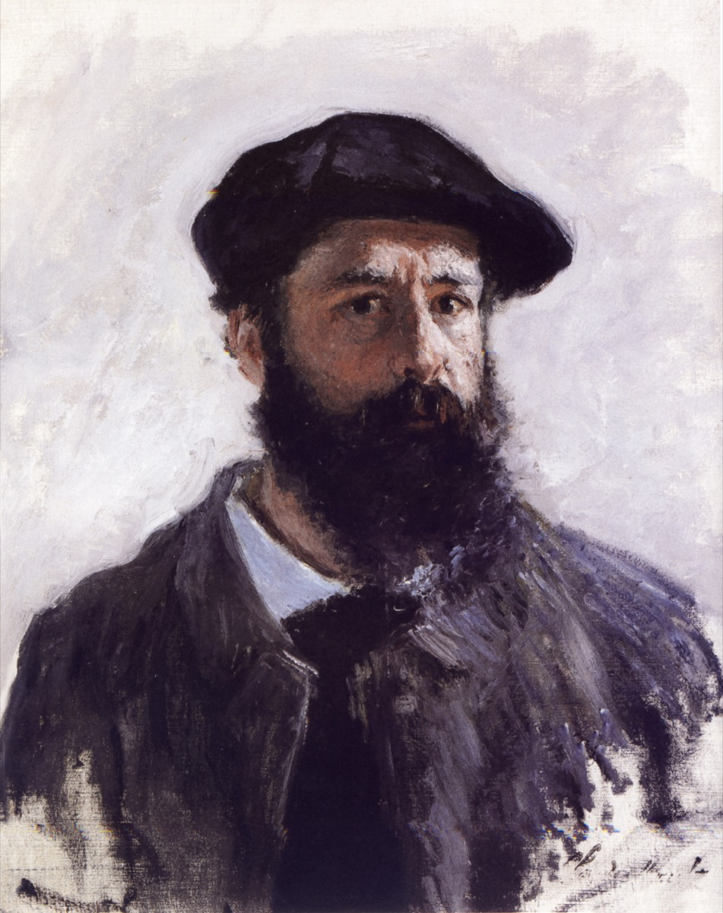
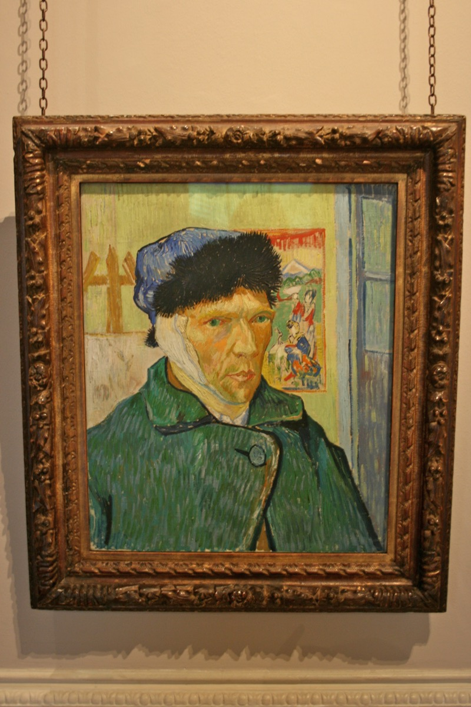
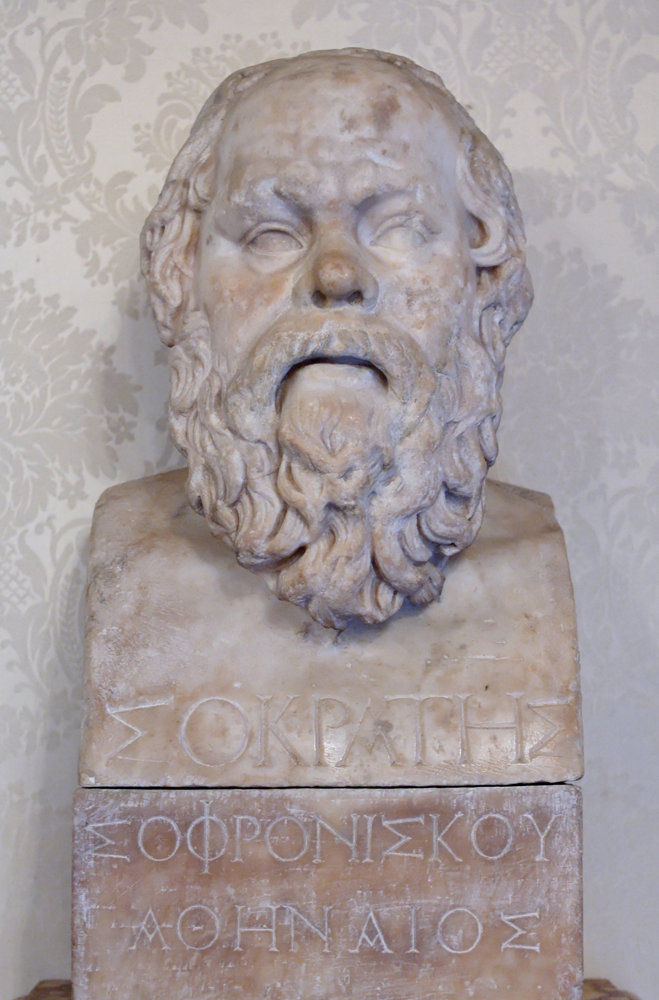
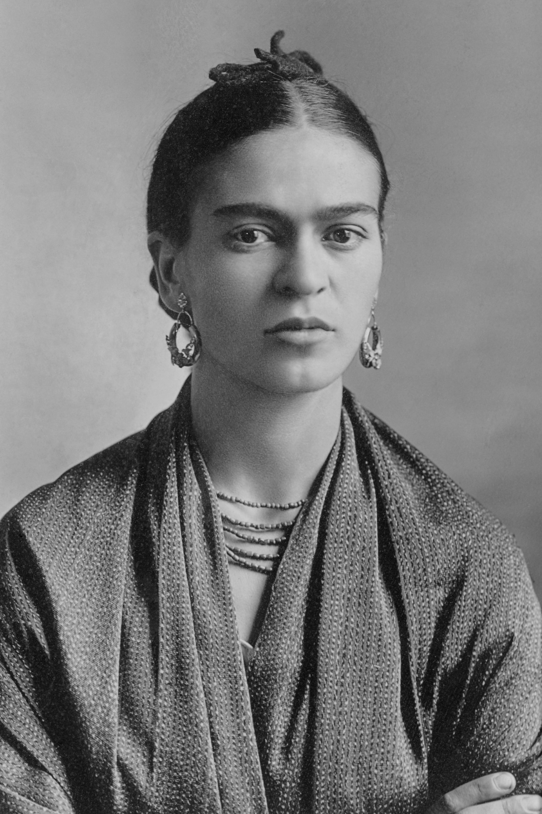
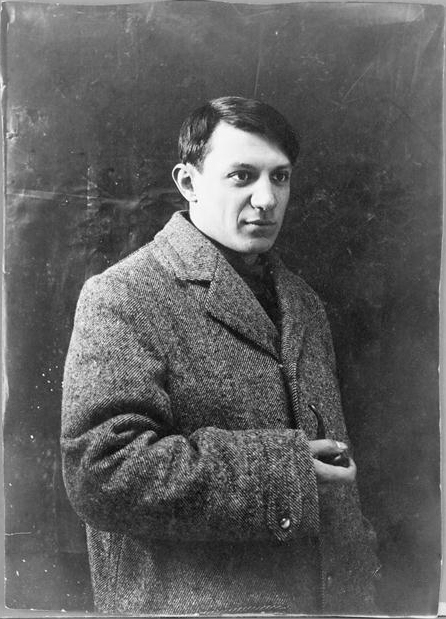
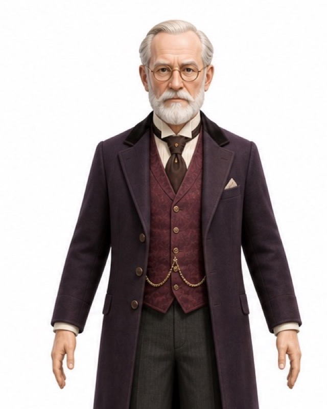
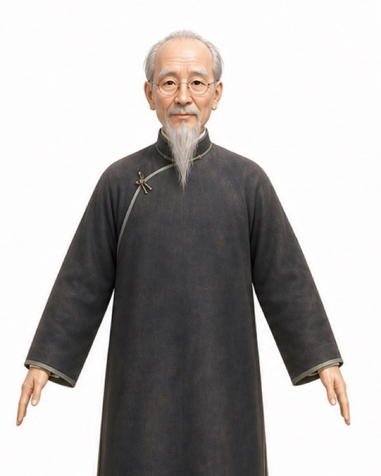
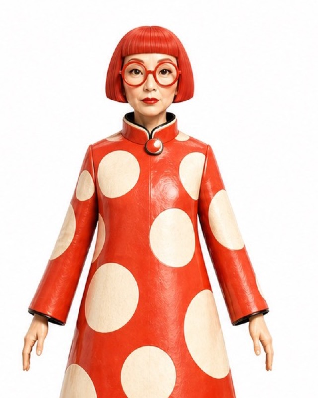
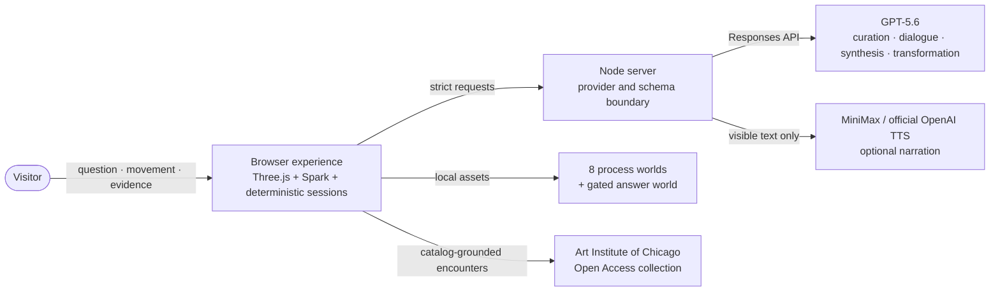

<div align="center">


<h1>MUSE&infin; &middot; The Impossible Museum</h1>

**Ask one question. Walk through the museum it becomes.**

MUSE turns a question you genuinely carry into an embodied learning journey. GPT-5.6
curates the inquiry, three AI interpretive companions walk beside you, and the evidence
from the journey becomes a personal answer concept you can enter.

[](https://openai.com/zh-Hans-CN/build-week/)
[](#how-gpt-56-is-used)
[](#built-with-codex-during-build-week)
[](#the-81-scene-spine)
[](LICENSE)

**OpenAI Build Week public repository:**
[SkylarWJY/muse-infinity-openai-build-week](https://github.com/SkylarWJY/muse-infinity-openai-build-week)

</div>

---

## The 60-second story

You arrive carrying a question such as *"What makes a life meaningful?"* You invite up
to three AI interpretive companions: Monet may follow light, Van Gogh may test emotional
pressure, and Socrates may challenge the claim hidden inside an image. GPT-5.6 shapes that
question into a bounded route through eight prepared, walkable museum worlds.

This is not a chatbot placed over a 3D background. Your company walks independently through
the same space, gathers around real public-domain artworks, and speaks in short, turn-based
exchanges. At each artwork station, the system keeps trusted catalog facts, the inquiry you
chose, the companions' grounded perspectives, and any observation you write in your own words.
A selected stance is never relabeled as something you personally observed.

After three artwork encounters, you leave one reflection for that scene. You can visit the
eight process worlds in any order. At the end, GPT-5.6 reads two distinct evidence layers:
the eight scene-level `visits` and the canonical `station_evidence` collected along the way.
It proposes a concept, then asks you to choose the unresolved contradiction between
**perception**, **emotion**, and **invention**. That decision triggers a second structured
GPT-5.6 transformation. Only then does the ninth world open, with your selected company facing
you for the close.

<div align="center">
<table>
<tr>
<td></td>
<td></td>
<td></td>
<td></td>
</tr>
</table>

*One living question, eight worlds of inquiry, and one gated answer world.*
</div>

---

## How to experience MUSE

### 1. Carry one real question

Cross the threshold and answer: **What question are you carrying?** Choose a prompt or write
your own. The question remains visible in the logic of every later scene; it is not discarded
after onboarding.

### 2. Choose who walks with you

Select one to three of eight bounded AI interpretive lenses. They are generated perspectives,
not authentic quotations, endorsements, or the named people speaking.

<div align="center">
<table>
<tr>
<td align="center"><br/><sub>Claude Monet</sub></td>
<td align="center"><br/><sub>Vincent van Gogh</sub></td>
<td align="center"><br/><sub>Socrates</sub></td>
<td align="center"><br/><sub>Frida Kahlo</sub></td>
</tr>
<tr>
<td align="center"><br/><sub>Pablo Picasso</sub></td>
<td align="center"><br/><sub>Sigmund Freud</sub></td>
<td align="center"><br/><sub>Qi Baishi</sub></td>
<td align="center"><br/><sub>Infinity &amp; Repetition</sub></td>
</tr>
</table>
</div>

### 3. Watch GPT-5.6 prepare the route

GPT-5.6 returns a strict curation contract for the known eight-scene spine. It can frame the
inquiry and write bounded prompts, choices, gestures, and effects. It cannot invent a scene,
reorder the canonical spine, provide coordinates, or replace deterministic safety gates.
When a live provider is unavailable, the interface clearly labels the validated local path
as **CURATED DEMO** rather than presenting it as a live model response.

### 4. Walk, look, discuss, and leave evidence

- Use `W A S D` or the arrow keys to move, and drag to look.
- On mobile, use the on-screen joystick.
- Follow the embodied company to an artwork, then continue the conversation one speaker at a time.
- Choose an inquiry stance, ask a question, or write a specific observation. Station evidence
  does not have to contain a visitor-authored observation.
- Complete three artwork stations and one scene reflection before carrying that scene into the
  final synthesis. A fourth artwork remains available in each process world.
- Use **Atlas** to jump among the eight process worlds. Atlas never fabricates a completed visit
  and never reveals the ninth world early.
- Use **Sound** for the public-domain score, ambient texture, and synthetic narration; use
  **Voice** separately for supported microphone conversation.

### 5. Challenge the answer, then enter it

Summoning exposes what the journey actually retained. The Roundtable forms a provisional
concept from the eight visits plus station evidence. Your contradiction choice initiates a
second GPT-5.6 request that must materially change the title, synthesis, principle, and visual
prompt. The ninth scene is a prepared spatial realization of that concept, not geometry
generated live during the session.

---

## The 8+1 scene spine

The first eight worlds are the process. The ninth is the answer and cannot be entered early.

| # | Chapter | World | Primary lens | Spatial delivery |
| ---: | --- | --- | --- | --- |
| 1 | ARRIVAL | The Threshold Conservatory | Cross-temporal salon | Quality RAD world + collider |
| 2 | QUESTION | The Court of Light | Sigmund Freud | Quality RAD world + collider |
| 3 | PERCEPTION | The Garden of Water and Light | Claude Monet | Quality RAD world + collider |
| 4 | INVENTION | The Sunset Frame Gallery | Pablo Picasso | Quality RAD world + collider |
| 5 | INTENSITY | The Studio of the Burning Sky | Vincent van Gogh | Quality RAD world + collider |
| 6 | TRANSFORMATION | The Petal Transition Hall | Qi Baishi | Quality RAD world + collider |
| 7 | IDENTITY | The Courtyard of Living Memory | Frida Kahlo | Quality RAD world + collider |
| 8 | INFINITY | The Infinite Repetition Chamber | Infinity & Repetition | 8K texture GLB + SPZ fallback |
| 9 | ANSWER | Your Dream World | Visitor + selected company | Prepared 8K texture GLB |

<div align="center">
<table>
<tr>
<td><br/><sub>01 &middot; ARRIVAL</sub></td>
<td><br/><sub>02 &middot; QUESTION</sub></td>
<td><br/><sub>03 &middot; PERCEPTION</sub></td>
<td><br/><sub>04 &middot; INVENTION</sub></td>
</tr>
<tr>
<td><br/><sub>05 &middot; INTENSITY</sub></td>
<td><br/><sub>06 &middot; TRANSFORMATION</sub></td>
<td><br/><sub>07 &middot; IDENTITY</sub></td>
<td><br/><sub>08 &middot; INFINITY</sub></td>
</tr>
</table>


**09 &middot; ANSWER &mdash; Your Dream World**<br/>
*The prepared finale opens only after the evidence-grounded Roundtable and transformation.*
</div>

---

## What makes MUSE different

| Design decision | What it changes |
| --- | --- |
| **Embodied inquiry, not a chat panel** | The learner and selected companions share the scene. Each companion has an independent movement director and converges on separated, collider-grounded conversation positions that preserve the artwork sightline. |
| **Evidence, not generic memory** | The final digest preserves all eight scene-level visits and the canonical station records. Inquiry paths remain distinct from visitor-authored observations. |
| **A collection, not wallpaper** | Each process world contains four globally unique Art Institute of Chicago Open Access works. The first three form the guided evidence route; the fourth remains explorable. |
| **GPT inside a bounded world** | GPT-5.6 personalizes curation, dialogue, synthesis, and transformation while deterministic code owns scene identity, order, assets, coordinates, movement, rendering, and gates. |
| **High-fidelity assets without preload flashes** | A full-viewport, high-resolution scene poster remains visible while each local RAD/GLB world, collider, and cast initialize. A failed presentation-quality gate keeps the poster visible and the scene retryable instead of exposing coarse fallback geometry. |
| **An ending the learner changes** | The provisional concept cannot pass directly to the finale. The learner's contradiction choice triggers a schema-validated second transformation before the manifesto and answer world unlock. |
| **Honest fallback behavior** | Missing or invalid remote output activates a visibly labeled curated contract. The complete journey remains judgeable without paid API credentials. |

---

## How GPT-5.6 is used

Every runtime **language and judgment** request is allowlisted to `gpt-5.6` or
`gpt-5.6-sol` and uses the Responses API contract:

1. **Curation:** strict Structured Output binds the visitor's question to the fixed eight-world
   route and returns bounded scene prompts and interactions.
2. **Artwork dialogue:** one strict-schema perspective per selected companion is grounded in
   trusted scene metadata, focused-artwork facts, and recent evidence.
3. **Roundtable synthesis:** GPT-5.6 receives the complete eight-visit digest plus sanitized
   station evidence. It returns a provisional title, synthesis, principle, visual prompt,
   ordered evidence references, and one perspective for each selected lens.
4. **Decision transformation:** the selected `perception`, `emotion`, or `invention` axis is
   locked into a second strict schema. Validation rejects a response unless the world title,
   synthesis, principle, and visual prompt all materially differ from the provisional concept.

The server accepts two disclosed remote origins:

- `https://api.openai.com` is the **official OpenAI Platform** route.
- `https://api.baizhiyuan.cloud` is an **authorized OpenAI-compatible Responses gateway**. It is
  not described as an official direct OpenAI connection.

OpenAI Realtime and OpenAI TTS are enabled only for the official OpenAI origin. On the compatible
gateway they remain unavailable rather than implying endpoint support that has not been
established. MiniMax can render already-visible narration with distinct synthetic cast voices;
it performs no language reasoning. Browser speech is the final voice-only fallback.

The final generation claim is deliberately precise: **GPT-5.6 personalizes the answer
concept; the ninth world's geometry is a prepared, pre-generated realization.**

---

## Architecture



- `JourneySession` owns the ten visitor-facing beats and answer-world gate.
- `LessonSession` owns eight scene visits; `SceneTourSession` owns the artwork-station records.
- `shared/contracts.js` is the trust boundary for curation, evidence digests, salon output, and
  transformed concepts.
- `exhibitionSpine.js` owns the immutable 8+1 identity and order; the model never owns geometry.
- World assets load locally, so the canonical judging path does not depend on a world-generation
  API succeeding during the demo.

Exact asset byte counts, hashes, source sizes, colliders, and reproduction commands are in
[PROVENANCE.md](docs/PROVENANCE.md).

---

## Run at port 4175

Requirements: Node.js 20.12 or newer.

```bash
npm install
npm start
```

Open <http://127.0.0.1:4175>.

### No-key judging path

No `.env` file is required. The complete 8+1 journey, local high-fidelity worlds, artwork
collection, movement, evidence ledger, curated transformation, score, and browser-supported
speech fallbacks remain available. Remote model output is replaced by a visibly labeled,
schema-validated **CURATED DEMO** path; no paid request is attempted.

### Optional live configuration

```bash
OPENAI_API_KEY=...
OPENAI_BASE_URL=https://api.openai.com
OPENAI_MODEL=gpt-5.6

# Optional expressive narration; no language reasoning
MINIMAX_API_KEY=...

PORT=4175
HOST=127.0.0.1
```

The remote base URL is an exact allowlist: the official OpenAI origin shown above or the
disclosed compatible gateway. Secrets remain server-side. Local Codex credentials may be
selected explicitly with `MUSE_OPENAI_CONFIG=codex`; see [`.env.example`](.env.example) for the
full provider boundary. All nine canonical worlds are local and require no runtime World Labs
credential.

For the checked-in PM2 configuration:

```bash
npm run pm2:start
npm run pm2:logs
```

It pins one process to this checkout at `127.0.0.1:4175`.

---

## Verification

```bash
npm run check
npm test
npm run audit:providers
npm run test:e2e
npm audit --audit-level=high
```

The automated evidence covers the canonical 8+1 manifest, ten-beat journey gate,
three-station scene tours, eight scene reflections, station-evidence semantics, strict initial
and transformed GPT schemas, independent companion movement, artwork placement and real image
ratios, high-fidelity renderer policy, Range delivery, bounded asset loading, desktop/mobile
flows, provider allowlists, and public-surface secret boundaries.

Independent acceptance findings and their current dispositions are published in
[ACCEPTANCE_CROSS_VALIDATION.md](docs/ACCEPTANCE_CROSS_VALIDATION.md) and the
[27-point review](docs/ACCEPTANCE_27_POINT_REVIEW.md).

---

## Built with Codex during Build Week

MUSE Infinity existed before OpenAI Build Week, so this repository makes that boundary explicit.

**Pre-Submission Period foundation:** the core impossible-museum thesis; nine prepared spatial
worlds and colliders; scene images and thumbnails; interpretive-companion assets and portraits;
and the underlying rights-cleared/open-access collection materials.

**OpenAI Build Week work completed with Codex:** the strict ten-beat 8+1 state machine;
three-station inquiry tours; GPT-5.6 Structured Outputs for curation, grounded dialogue,
provisional synthesis, and contradiction-triggered transformation; independently directed
embodied companions; correspondence evidence; high-resolution readiness transitions;
responsive presentation; provider and secret boundaries; narration fallbacks; and automated
unit, integration, provider-audit, and Playwright coverage.

The public, redacted engineering record documents the workflow from product constraints through
tests and review without exposing credentials, private logs, or hidden reasoning:

- [Build process evidence](docs/BUILD_PROCESS_EVIDENCE.md)
- [Submission package and recording plan](docs/SUBMISSION.md)
- [Asset and service provenance](docs/PROVENANCE.md)
- [Character production pipeline](docs/CHARACTER_PIPELINE.md)

**Majority core-functionality Codex session for `/feedback`:**

```text
019f7e53-4039-7cc1-9162-01906bec47b7
```

---

## Rights and representation

- Historical names label bounded **AI interpretive lenses**. Generated lines are not authentic
  quotations, endorsements, historical testimony, or cloned voices.
- Yayoi Kusama is living. The eighth lens is presented as **Infinity & Repetition**, never as
  Kusama herself speaking or approving the experience.
- Artworks use Art Institute of Chicago Open Access records with source and rights metadata.
- Reviewed music recordings are public domain; narration voices are synthetic.
- World Labs spatial assets and Tripo character assets retain their recorded source terms.
- Source code and authored documentation are released under the [MIT License](LICENSE). Bundled
  generated and third-party assets retain their applicable terms.

See [THIRD_PARTY_NOTICES.md](THIRD_PARTY_NOTICES.md) and
[PROVENANCE.md](docs/PROVENANCE.md) for the complete notices and hashes. The project uses
authorized third-party integrations within the
[OpenAI Build Week Official Rules](https://openai.devpost.com/rules); GPT-5.6 remains the runtime
reasoning model.

<div align="center">

**MUSE&infin; &mdash; because the best answer to a real question may be a world you can walk through.**

</div>
