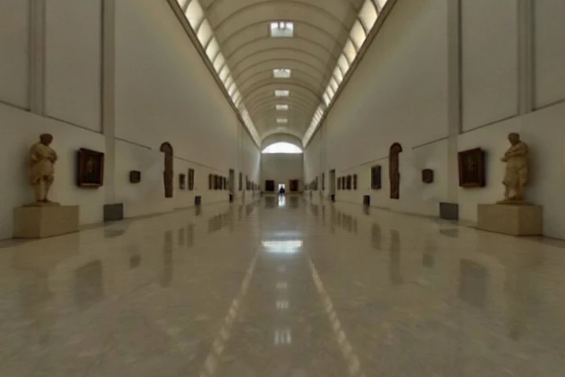

# MUSE: The Archived Museum, In Motion

MUSE turns one learner question into a guided journey through the digital worlds of
`muse-infinity`. The World Labs scenes and Tripo companions are not a backdrop or a
thumbnail gallery: they are the places and people used by the main interaction.

The learner chooses up to three companions, follows the first companion through a
three-stop exhibition, answers from visible evidence, convenes the selected company in
the Perspective Salon, and walks into a second archived world as the rewritten answer.
GPT-5.6 supplies bounded lesson and Salon reasoning; deterministic code owns movement,
scene coordinates, rendering and fallbacks.

Built with Codex for the **Education** track of
[OpenAI Build Week](https://openai.com/zh-Hans-CN/build-week/).
Public repository: <https://github.com/baizhiyuan/muse>

<table>
  <tr>
    <td></td>
    <td></td>
    <td></td>
  </tr>
  <tr>
    <td align="center">Bright Gallery Hall</td>
    <td align="center">Van Gogh Gallery</td>
    <td align="center">Infinity Dot Room</td>
  </tr>
</table>


## The judging path

1. Ask the question you want the museum to hold.
2. Invite one to three archived companions: Monet, Van Gogh, Socrates, Frida Kahlo or
   Picasso.
3. Let GPT-5.6, or the validated local fallback, turn the question into a three-stop
   route.
4. Enter the real Bright Gallery SPZ. The first selected companion becomes the guide,
   walks to each declared anchor, faces the artwork, gestures, asks, listens and reflects.
5. Complete the route and convene the selected companions in the Perspective Salon.
6. Rewrite the answer into the archived Van Gogh Gallery or Infinity Dot Room and enter
   it as the final walkable scene.

The complete path works without credentials. Missing credentials are reported honestly:
the local archived assets and curated contracts stay active, and no paid request is sent.

## Preserved flow, deeper interaction

The earlier `muse-infinity` product established the narrative spine:

```text
question -> companions -> curation -> world walk -> roundtable -> transformed world
```

This repository deliberately keeps that spine. Its compact journey state is:

```text
threshold -> company -> curation -> walk -> salon -> rewrite
```

The Build Week delta is the spatial behavior between those beats:

- the three shipped World Labs SPZs are the primary worlds, not optional previews;
- five shipped Tripo GLBs and their archived portraits are selectable companions;
- the first selected GLB is driven by the guide state machine and visibly moves between
  scene anchors;
- dialogue is released only after deterministic distance and facing checks succeed;
- observation choices change the physical route;
- selected GLBs materialize together in the Salon;
- the final answer changes the loaded archived scene.

The old mixed-model application runtime was not copied. In particular, Claude,
OpenAI-compatible proxy endpoints and the old MiniMax narration path are absent from this
runtime.

## Digital asset core

| Asset family | Shipped assets | Runtime role |
| --- | --- | --- |
| World Labs scenes | Bright Gallery Hall, Van Gogh Gallery, Infinity Dot Room | Default world, alternate Atlas worlds and rewritten final world |
| Tripo companions | Monet, Van Gogh, Socrates, Frida Kahlo, Picasso | Guide selection and embodied Salon company |
| Rigged learner | GPT Image 2 turnaround -> Tripo P1 biped GLB | Player idle/walk skeletal animation |
| Archived portraits | One portrait for each shipped companion | Selection, speaker and Salon identity |
| Open-access artworks | *Water Lilies*, *The Bedroom*, *La Grande Jatte* | Versioned evidence anchors inside every world |

All three deployed SPZs contain 500,000 splats. Spark adaptive LOD targets about 130,000
visible splats on desktop and 80,000 on mobile. The character GLBs were reduced offline
from approximately 58-60 MB each to approximately 1.9-2.1 MB each. Exact byte counts,
SHA-256 hashes, source records and reproduction commands are in
[docs/PROVENANCE.md](docs/PROVENANCE.md).

## OpenAI-only reasoning boundary

OpenAI GPT models are the only language and reasoning runtime in this repository.

- **Lesson planning:** GPT-5.6 uses the Responses API and strict Structured Outputs to
  return only known stop, detail, gesture and effect IDs.
- **Adaptive inquiry:** GPT selects bounded semantic actions; deterministic code resolves
  route order, coordinates, movement and rendering.
- **Perspective Salon:** GPT-5.6 returns three contrasting readings grounded only in the
  capped evidence digest from the current session.
- **Voice:** the optional browser voice path uses OpenAI Realtime WebRTC through the
  server relay.
- **Failure behavior:** invalid, late or unavailable output is never labeled live; the
  validated curated lesson and Salon contracts remain usable.

World Labs and Tripo are the provenance of pre-generated spatial and character assets,
not language or reasoning providers. The separately gated Forge tool can optionally send
an explicit spatial-generation request to World Labs, but it is outside the judging path,
requires both a provider key and an admin token, and never performs language reasoning.

All Responses API calls use `store: false`, a hashed `safety_identifier`, strict schemas,
a bounded timeout and at most one transient retry. The OpenAI host is fixed to
`api.openai.com`; there is no configurable alternate LLM endpoint.

## Run locally

Requirements: Node.js 20.12 or newer.

```bash
npm install
cp .env.example .env
npm start
```

Open <http://127.0.0.1:4175>. The `.env` file is optional for the complete curated path.

### Optional environment

```bash
OPENAI_API_KEY=...
OPENAI_MODEL=gpt-5.6
OPENAI_REALTIME_MODEL=gpt-realtime
WORLDLABS_API_KEY=...
INTEGRATION_ADMIN_TOKEN=...
PORT=4175
HOST=127.0.0.1
```

`npm start` loads `.env` through Node's native env-file parser. Secrets remain server-side.
Set `HOST=0.0.0.0` only for a container or hosted deployment. World Labs generation is enabled only when both World Labs
variables are present; it is not needed to load any of the three local worlds.

## Controls

- `W A S D` or arrow keys: walk and turn.
- Pointer drag: look around.
- Follow control: let the camera follow the guide.
- Mobile joystick: move without a keyboard.
- Atlas: compare the three archived worlds at any point.

## Architecture

```text
Browser                                  Server
src/main.js                              server.mjs
  JourneySession                           services/openai.js
  LessonSession                            services/worldLabs.js
  MuseumEngine                             services/rooms.js
    GuideDirector                          shared/contracts.js
    ArchivedAvatar / ProceduralAvatar
    WorldLayer -> Spark SPZ + fallback
  AppView / Profile / Voice / API
```

`shared/contracts.js` is the model boundary. GPT can choose only known IDs and verbs.
`GuideDirector` translates that contract into deterministic movement and exposes anchor
distance and facing error for UI evidence and tests. `src/config/legacyAssets.js` is the
single manifest for every archived world, transform, spatial profile, companion model and
portrait.

## Verify

```bash
npm run check
npm test
npm run audit:providers
npm run test:e2e
npm audit --audit-level=high
```

The tests parse the SPZ and GLB structures, verify the learner skin and idle/walk clips, lock
the compact legacy flow, test avatar motion selection, audit the OpenAI-only reasoning
boundary, and exercise the complete desktop/mobile no-key journey with real canvas pixels.

## Current limits

- The five inherited companion GLBs contain static meshes; their gestures still use bounded
  shader deformation. The learner is a separate 52-joint skinned GLB with baked idle/walk
  skeletal animation, but it does not use full-body IK.
- Navigation uses declared bounds and anchors, not a navmesh or the old collider pipeline.
- There is no lip sync. OpenAI Realtime voice is optional and text remains authoritative.
- Procedural architecture and a procedural avatar remain only as loading/error fallbacks.
- Collaboration rooms are in-memory and intended for a demo, not production persistence.
- Live OpenAI, Realtime, Forge and real-hardware GPU performance require credentials or
  hardware outside the default automated suite.
- Upstream World Labs IDs and the inherited companion task IDs remain incomplete. The new
  learner task IDs are recorded, but provider output terms still apply to redistribution.

Source code and authored documentation are released under the [MIT License](LICENSE).
Bundled generated and third-party assets are excluded from that grant; see
[THIRD_PARTY_NOTICES.md](THIRD_PARTY_NOTICES.md).

## Codex session

Majority core-functionality session for `/feedback`:

`019f7e53-4039-7cc1-9162-01906bec47b7`
