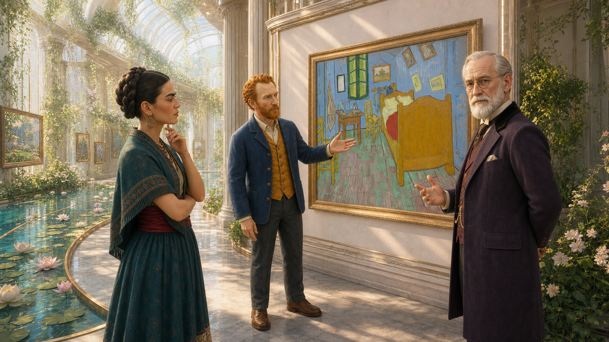
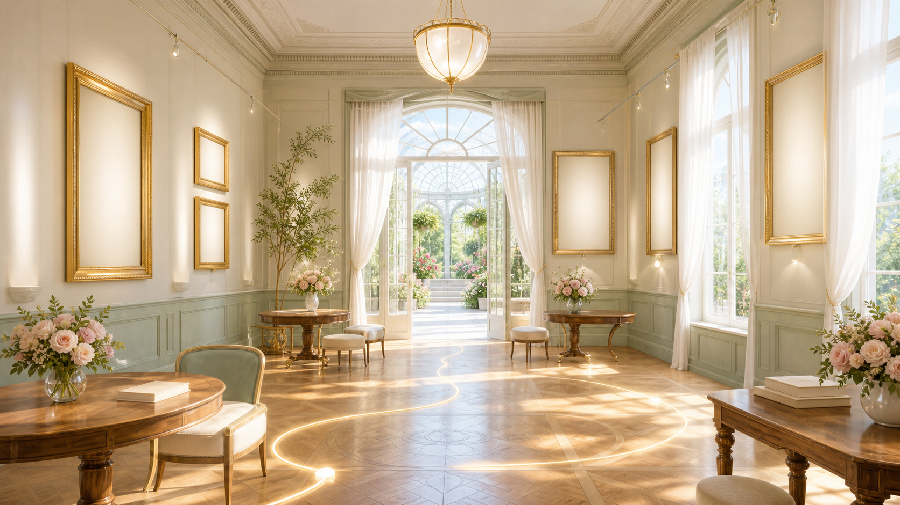
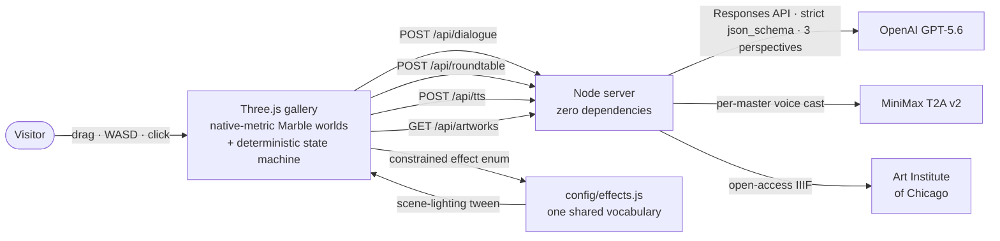

<div align="center">


<h1>MUSE∞ · The Impossible Museum</h1>

**Ask one question. Learn by walking through the museum it becomes.**
A playable, AI-native learning museum built with Codex and powered by GPT-5.6: a learner's question curates the collection, AI masters
walk beside you and argue about every painting in their own voices, and at the end the
walk you *actually took* is synthesised into a reflective world that makes your learning visible.

[](https://openai.devpost.com)
[](#-built-with-codex--gpt-56)
[](https://www.worldlabs.ai)
[](https://www.tripo3d.ai)
[](https://www.minimax.io)
[](#%EF%B8%8F-architecture)
[](https://www.artic.edu/open-access)
[](LICENSE)
[](#%EF%B8%8F-built-with)

</div>

<div align="center">


*The whole walk in 15 seconds — [watch the full demo with sound ▶](https://youtu.be/PlCZUTLrMvI)*

</div>

---

## ⏱️ OpenAI Build Week — judge fast path

- 🎬 **44-second public demo:** [youtu.be/PlCZUTLrMvI](https://youtu.be/PlCZUTLrMvI)
- 🏁 **Category:** Education — an inquiry-based learning experience for students, teachers and cultural education institutions.
- 🧠 **Required stack:** the project was implemented through Codex sessions using GPT-5.6 under human product direction; the live experience also uses GPT-5.6 through the OpenAI Responses API.
- 🗓️ **New during the submission period:** the included implementation was produced July 18–21, 2026, and this clean competition repository was created on July 21, 2026. No pre-Build Week code is included.
- 🧪 **Evidence:** executable contract tests, the dated [`docs/BUILD_PROVENANCE.md`](docs/BUILD_PROVENANCE.md), and the engineer-facing product specification.
- 📝 **Submission copy and compliance checklist:** [`docs/SUBMISSION.md`](docs/SUBMISSION.md).

**Run it** — zero API keys required, the full walk works offline. The worlds are a
one-time ~790 MB download from the release, so give it a few minutes:

```bash
git clone https://github.com/SkylarWJY/muse-infinity-openai-build-week && cd muse-infinity-openai-build-week
gh release download worlds-v1 && unzip -o worlds.zip -d assets/ && unzip -o characters.zip -d assets/
npm start   # → http://localhost:4173
```

**The 3-minute path:** type a question → invite Monet, Van Gogh, Socrates → click any
painting (three parallel live readings, the room re-lights) → click the tour HUD to
auto-walk between stops → the closing roundtable reads *your* walk → step into the
world it names.

---

## 🌌 Why this exists

**Students are surrounded by answers, but education still needs better ways to teach
them how to question, compare evidence and form an interpretation of their own.**
Art is ideal material for this work, yet classroom access is often limited to a slide,
a textbook paragraph or one authoritative wall label. MUSE∞ turns open-access cultural
collections into an inquiry-based learning environment:

- **It teaches through questions** — a learner's question, not a fixed syllabus order,
  determines which works and perspectives belong together.
- **It makes comparison unavoidable** — three distinct GPT-5.6 perspectives disagree
  about the same evidence, asking learners to compare claims rather than accept one AI answer.
- **It connects interpretation to evidence** — every response remains grounded in real
  artwork metadata, visible sources and the work the learner actually selected.
- **It supports reflection** — the closing roundtable synthesises the learner's path,
  helping them see how their choices and questions shaped the conclusion.

Generated worlds are not for escaping reality — they are for **learning inside ideas**.
A question is an invisible thing; MUSE∞ makes it a place a learner can explore, discuss
and remember.

**One question in. One reflective world out. Everything in between is active learning.**

---

## 🎬 The 60-second story

You arrive with one existential question — *"What makes a life meaningful?"* — and the
museum builds itself around it. You pick three masters (Monet, Van Gogh, Socrates…)
and step into a **walkable, AI-generated 3D world** where real public-domain paintings
hang on the walls. Click one and it becomes a **game dialogue**: a master opens in
character, you answer, another master answers *you* — then all three deliver **live,
parallel LLM readings of that exact painting**, each in their own cast voice, while the
room's light literally changes with each reading. When you're done walking, the masters
hold a **closing roundtable about the walk you actually took** — the paintings you
stopped at, the questions you asked — and name the world your choices built. Then you
step into it.

<div align="center">
<table><tr>
<td></td>
<td></td>
<td></td>
<td></td>
</tr></table>

*Four of the nine World Labs Marble worlds generated for MUSE∞ — every one walkable,
collider-grounded, and rendered at native metric scale.*
</div>

---

## 🎮 How to play

### Act I — One question opens the gate

Type the question you actually carry — *"What makes a life meaningful?"* — and
stop. That is the only input the museum ever asks for.

### Act II — Choose the minds who walk with you

<div align="center">


*The masters don't sit in a chat panel. They stand in the world, walk with you,
and are clickable.*
</div>

Invite up to three of seven masters. Each is built from a documented public-domain
portrait into a full 3D figure via **Tripo**, and each carries an authored lens that
makes their reading of a painting genuinely their own.

### Act III — The museum curates itself, visibly

GPT reads your question and answers with a themed exhibition title, three chapter
names, and a preview of the route it has planned. Curation is something you watch
happen, not something the interface claims.

### Act IV — Eight worlds, one continuous walk

<div align="center">
<table>
<tr>
<td align="center"><br/><sub><b>01 · ARRIVAL</b><br/>Glass Conservatory</sub></td>
<td align="center"><br/><sub><b>02 · QUESTION</b><br/>Floral Palace</sub></td>
<td align="center"><br/><sub><b>03 · PERCEPTION</b><br/>Water Garden</sub></td>
<td align="center"><br/><sub><b>04 · INVENTION</b><br/>Coastal Villa</sub></td>
</tr>
<tr>
<td align="center"><br/><sub><b>05 · INTENSITY</b><br/>Van Gogh Studio</sub></td>
<td align="center"><br/><sub><b>06 · TRANSFORMATION</b><br/>Sunlit Gardens</sub></td>
<td align="center"><br/><sub><b>07 · IDENTITY</b><br/>Mexican Courtyard</sub></td>
<td align="center"><br/><sub><b>08 · INFINITY</b><br/>Infinity Dot Room</sub></td>
</tr>
</table>

*The eight stops of the walk, in order.*
</div>

The exhibition is a **spine of eight generated worlds**, walked in order — not a menu.
Drag to look, `W A S D` to move; a **guided-tour HUD** names your next stop, points at
it and counts the metres down, so you are led rather than left wandering. The Marble
world streams in behind a dark veil (no placeholder flash) and your feet snap to the
real collider ground.

**Every world hangs its own artist.** The walls are not decoration reused from room to
room: thirty-six public-domain Art Institute works on the static floor, globally
deduplicated, so no painting is ever seen twice — and a live open-access fetch
upgrades each wall at runtime.

| Chapter | World | The collection on its walls |
|---|---|---|
| 01 · ARRIVAL | Glass Conservatory | Camille Pissarro |
| 02 · QUESTION | Floral Palace | Pierre-Auguste Renoir |
| 03 · PERCEPTION | Water Garden | Claude Monet |
| 04 · INVENTION | Coastal Villa | Paul Cézanne |
| 05 · INTENSITY | Van Gogh Studio | Vincent van Gogh |
| 06 · TRANSFORMATION | Sunlit Gardens | Georges Seurat |
| 07 · IDENTITY | Mexican Courtyard | Mary Cassatt |
| 08 · INFINITY | Infinity Dot Room | Vasily Kandinsky |

<div align="center">


**09 · ANSWER — the ninth world**
*Not on the walk. It opens only after the closing roundtable names it,*
*and the collection hanging inside is the one your philosophy chose.*
</div>

### Act V — Every painting is an encounter

Click a painting and a **visual-novel dialogue** rises: a master opens *in
character* about this exact work (typewriter text, skippable), you choose your
answer, and a different master responds to *you*. Seconds later the **live layer**
lands: three parallel LLM readings of the painting — grounded in its real metadata,
strictly schema-validated, each labeled `LIVE`, each carrying its own
AI-interpretation disclaimer — and each reading re-lights the room through a
constrained effect vocabulary. Click a **master** instead and you can ask them
anything; all three answer in their own voice, never each other's.

The **SOUND** toggle is on from the first page, and it plays like a game: each master speaks with a
distinct MiniMax-cast voice (Socrates is a deep British gentleman; Van Gogh burns),
while a per-act public-domain score — Mussorgsky's *Promenade* for the overture,
Debussy for the gallery, Satie for the salon — **ducks under every spoken line and
swells back after it**.

<div align="center">

</div>

### Act VI — The roundtable that read your walk

Your answers feed a philosophy meter (perception / emotion / invention). At the
end, the masters hold a closing roundtable **about your actual trajectory** — it
quotes the paintings you stopped at and the questions you asked, refuses to invent
stops you never made, and names the world your walk built. One click later you are
standing inside it: a finale-only Marble world that is not on the eight-stop walk,
hung with a collection matched to your philosophy.

<div align="center">
<table><tr>
<td></td>
<td></td>
</tr></table>

*The synthesis is yours: same product, different walk, different world.*
</div>

---

## ✨ What makes it interesting

| | |
|---|---|
| 🖼️ **A collection, not wallpaper** | Thirty-six public-domain Art Institute works, one artist cast per world, globally deduplicated — **no painting appears twice in the museum**. Every record keeps title, date, source URL and rights, and the live open-access fetch upgrades each wall at runtime without ever being required. |
| 🌍 **Real generated worlds, walked natively** | Nine World Labs Marble worlds rendered at **native metric scale** (no bounding-box renormalisation): baked transforms, collider-driven ground snapping and walk bounds, per-world tuning. The official Marble viewer look — but playable. |
| 🎭 **Three minds, not one chatbot** | One question returns **three parallel readings** in a single strict-JSON LLM call — per-master authored lenses, quarantined vocabularies (Monet may not borrow Van Gogh's words), positional speaker reconciliation. Divergence is engineered, not hoped for. |
| 🗣️ **A cast, not a TTS** | Seven masters, seven MiniMax voices chosen from the live voice catalogue. Sentence-segmented narration advances only on the previous segment's `ended` event — no mid-line cut-offs — with one-segment prefetch (no dead air) and a watchdog (no stuck queue). |
| 🎼 **A score that knows when to be quiet** | Per-act public-domain recordings — Mussorgsky's *Promenade* is literally music about walking an exhibition. Game-style ducking drops the score under any speaking master in ~0.6 s. |
| 🧠 **The ending is earned** | The closing roundtable is grounded in a capped, server-re-clamped digest of your real session — visited artworks, asked questions, what each master already told you. Walk differently, get a different world. |
| 🧯 **Honest by construction** | No canned prose behind an HTTP 200. Live replies are labeled `LIVE`; fallbacks say so on screen; failures return real errors with reasons. The static server whitelists public files and never serves `.env`, tests, or docs. |

---

## 🎓 Education track — who it helps

| Audience | Educational value |
|---|---|
| **Students** | Practice visual literacy, source awareness, comparative reasoning and metacognition by testing multiple interpretations against the same artwork. |
| **Teachers** | Use a question-led museum walk as a discussion starter, seminar activity or reflective assignment without requiring a paid API key for the core path. |
| **Schools and education programs** | Offer an interdisciplinary bridge between art, history, philosophy, writing and AI literacy in a repeatable browser-based experience. |
| **Museums and cultural institutions** | Turn open-access collections into interactive learning journeys while preserving artwork-level attribution, rights information and links to source records. |

MUSE∞ treats GPT-5.6 as a **perspective generator, not an authority**. Learners see that
responses are AI interpretations, compare disagreement between companions, and retain
access to the underlying artwork metadata. The educational goal is not to produce the
“correct” reading; it is to help learners ask better questions and support a reading with
evidence.

---

## 🏗️ Architecture



- **One effect vocabulary** (`config/effects.js`) feeds both the server's JSON-schema
  enum and the renderer's lighting targets — the two sides cannot drift apart.
- **Session digest** is capped at construction client-side *and* re-clamped
  server-side: a trust boundary, not a hope.
- Worlds are local `.spz`/`.glb` assets generated ahead of time with Marble —
  the judging path never depends on a paid call succeeding.

## 🤝 Built with Codex + GPT-5.6

MUSE∞ was created during the OpenAI Build Week submission period through an iterative
human–Codex workflow. The entrant set the product thesis, chose the artistic and ethical
constraints, reviewed every generated world, and decided which experience and engineering
tradeoffs were acceptable. Codex, using GPT-5.6, accelerated implementation across the
Three.js client, zero-dependency Node server, strict-schema OpenAI integration, contract
tests, performance fixes, accessibility and the documentation in this repository.

The collaboration was not a one-shot generation:

- **Codex accelerated the build:** it translated product direction into small, reviewable
  commits; implemented world loading, companion interaction, dialogue, roundtable and
  fallback paths; and turned acceptance feedback into targeted fixes.
- **Human decisions shaped the product:** the entrant defined “one question in, one world
  out,” selected the master cast and public-domain collection strategy, rejected visually
  weak worlds, set the honesty/disclaimer policy and chose quality over raw model speed.
- **GPT-5.6 powers the experience:** the server calls the OpenAI Responses API with strict
  JSON schemas to produce three grounded, divergent artwork readings and a closing
  roundtable based only on the visitor's actual walk.
- **The learning design stays intentional:** Codex helped implement source-preserving
  artwork records, multi-perspective comparison, visible AI labels, bounded session memory
  and a reflective ending so GPT-5.6 supports inquiry instead of replacing the teacher.
- **Verification stayed explicit:** Codex-produced changes were checked with syntax gates,
  API contracts, live-path checks when credentials were available and repeated browser
  acceptance passes.

Build provenance is documented in [`docs/BUILD_PROVENANCE.md`](docs/BUILD_PROVENANCE.md)
and the engineer-facing [`docs/LATEST_PRODUCT_SPEC.md`](docs/LATEST_PRODUCT_SPEC.md).
The required `/feedback` Codex Session ID is intentionally kept in the private Devpost
submission rather than committed to the public repository.

## 🛠️ Built with

| Tool | Role |
|------|------|
| [**World Labs Marble**](https://www.worldlabs.ai) | All nine walkable worlds — generated from authored prompts + reference images, rendered natively as splat + collider pairs. |
| [**Tripo**](https://www.tripo3d.ai) | The masters' 3D bodies — multiview turnaround sheets → reviewed GLB companions that walk with the visitor. |
| [**MiniMax**](https://www.minimax.io) | `speech-2.8-turbo` per-master narration — seven voices cast from the live catalogue. |
| **OpenAI GPT-5.6 + Responses API** | Three-perspective artwork readings and the closing roundtable — strict `json_schema`, bounded retry, honest 502s. GPT-5.6 was also the model used through Codex to build and iterate on the project. |
| [**Art Institute of Chicago Open Access**](https://www.artic.edu/open-access) | Every painting on the walls, with title/date/source/rights intact. |
| [**Three.js**](https://threejs.org) | Rendering, raycasting, collider walking. Everything else is **vanilla JS, zero build step**. |

## 🧾 APIs & paid services (full disclosure)

| Service | Used for | Tier |
|---|---|---|
| World Labs Marble | nine world generations — pre-generated during the event, shipped as local assets | paid API |
| Tripo | master turnarounds → GLB bodies | paid API |
| MiniMax speech-2.8-turbo | per-master narration cast | paid API |
| OpenAI GPT-5.6 / Responses API | three-perspective readings + roundtable | paid API |
| Art Institute of Chicago Open Access | every painting on the walls | free |
| Three.js · vanilla JS · Node.js | rendering, server, everything else | open source |

## 📦 Get the worlds (one download)

The nine Marble worlds (511 MB of `.spz` splats + `.glb` colliders) and five master
GLB companions (278 MB) are distributed via a
[GitHub Release](https://github.com/SkylarWJY/muse-infinity-openai-build-week/releases/tag/worlds-v1) —
too heavy for a git tree, too real to fake:

```bash
gh release download worlds-v1 --repo SkylarWJY/muse-infinity-openai-build-week
unzip -o worlds.zip -d assets/ && unzip -o characters.zip -d assets/
```

Everything else — dialogue, roundtable, artwork walls, audio, tests — runs from this
repo alone.

## 🚀 Run it

**Zero API keys required** — the full walk, dialogue fallbacks and score all work
offline once the worlds are downloaded. Keys only upgrade dialogue and narration to
live. Requirements: Node.js 20+.

```bash
npm start          # serves http://localhost:4173
npm run check      # syntax gate over every runtime file
npm test           # API contracts + public-surface/secret boundaries
```

| `.env` (all optional) | Unlocks |
|---|---|
| `OPENAI_API_KEY` or `LLM_API_KEY` | Live GPT-5.6 three-perspective dialogue + roundtable through the OpenAI Responses API (labeled `LIVE`) |
| `OPENAI_MODEL` / `LLM_MODEL` | Optional model override; defaults to `gpt-5.6` |
| `LLM_BASE_URL` | Optional endpoint override; defaults to `https://api.openai.com` |
| `MINIMAX_API_KEY` | Per-master voice narration behind the SOUND toggle |
| *(nothing)* | The full walk still works — with clearly labeled local fallbacks |

**Controls:** drag to look · `W A S D` walk · click paintings & masters · scene dots
to move along the spine · **SOUND** toggle (top right, on by default — the score
starts on your first click, as the autoplay policy requires) · `1`…`9`,`0` step
through the ten acts · `R` reset · `P` performance tier.

## 🛡️ Rights & representation

- Historical figures are **explicitly interpretive AI perspectives** — every
  attributed line carries a visible disclaimer; no quotation, no endorsement, no
  voice cloning of real people.
- Artworks: public-domain / open-access records only, always with source and rights.
- Music: public-domain recordings. Voices: synthetic casting.
  Everything bundled is itemised in [`THIRD_PARTY_NOTICES.md`](THIRD_PARTY_NOTICES.md).
- No accounts, no personal data, no tracking.

## 🏁 OpenAI Build Week alignment

| Judging criterion | Evidence in MUSE∞ |
|---|---|
| **Technological Implementation** | A non-trivial Codex-built application with a walkable Three.js world, OpenAI Responses API integration, strict JSON schemas, server-side trust boundaries, fallbacks and contract tests. |
| **Design** | A coherent six-act learning journey with question formation, source-grounded exploration, multi-perspective comparison, spatial interaction and a reflective personalized finale. |
| **Potential Impact** | Helps students develop visual literacy, critical comparison and AI literacy; gives teachers a reusable inquiry activity; and helps institutions activate open-access cultural collections for education. |
| **Quality of the Idea** | The learner's question becomes the curriculum, disagreement between GPT-5.6 perspectives becomes the learning mechanism, and the final synthesis is grounded in the learner's actual evidence trail rather than a generic chatbot answer. |

MUSE∞ was implemented July 18–21, 2026, entirely inside the OpenAI Build Week submission
period. This competition repository intentionally uses a clean, entrant-authored history
and does not import contributor metadata from any other repository.

Released under the [MIT License](LICENSE).

<div align="center">
<sub>MUSE∞ — because the best answer to a real question is a world you can walk through.</sub>
</div>
