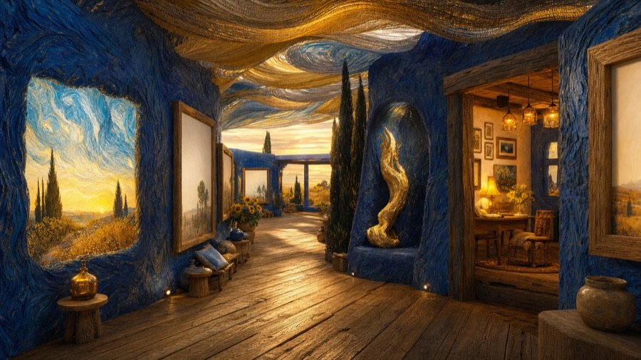
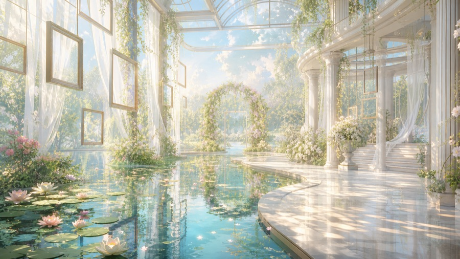
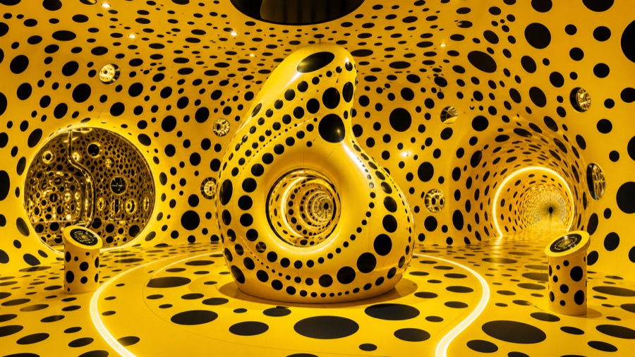
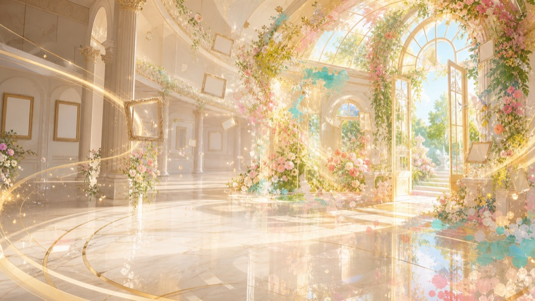
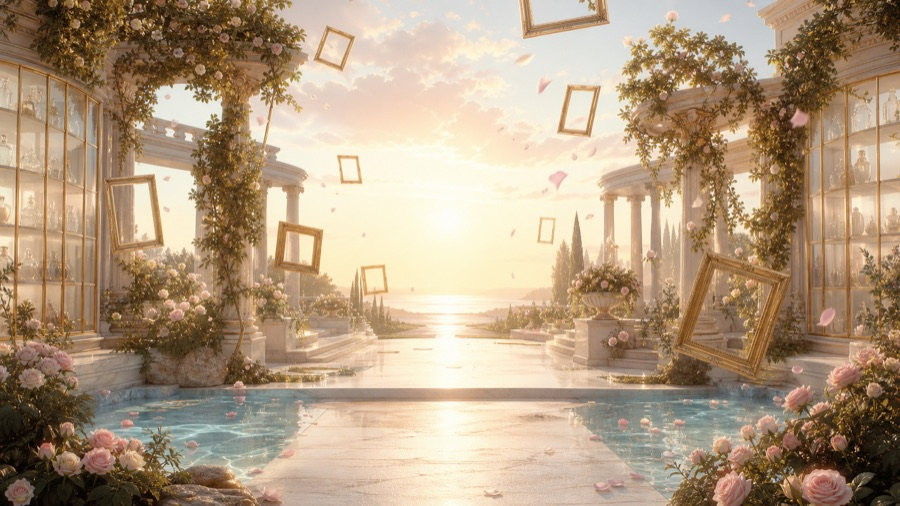

<h1>MUSE∞ · The Impossible Museum</h1>

**Ask one question. Learn by walking through the museum it becomes.**

A playable, AI-native learning museum built with Codex and powered by GPT-5.6.
Choose the artists and thinkers who will walk beside you, study real open-access
artworks across eight embodied worlds, and carry the evidence from that journey into
a personalized concept embodied by a prepared, gated ninth answer world.

*Ask a living question, choose your company, and begin the walk -
[watch the 44-second demo with sound](https://youtu.be/PlCZUTLrMvI).*

---

## ⏱️ OpenAI Build Week - judge fast path

- **44-second public demo:** [youtu.be/PlCZUTLrMvI](https://youtu.be/PlCZUTLrMvI)
- **Category:** Education - an inquiry-based learning experience for students,
  teachers and cultural education institutions.
- **Required stack:** Codex and GPT-5.6 were used to implement and verify the
  submission-period work; configured live reasoning uses GPT-5.6 through the official
  Responses API, the disclosed authorized Responses-compatible gateway, or an explicitly
  selected local Codex loopback provider.
- **No-key path:** the complete curated journey, local worlds and progression gates
  work without paid credentials. Live GPT reasoning, narration, Realtime voice and
  Forge are optional upgrades.
- **Evidence:** executable contract and browser tests, exact asset hashes in
  [docs/PROVENANCE.md](docs/PROVENANCE.md), and the independent acceptance record in
  [docs/ACCEPTANCE_CROSS_VALIDATION.md](docs/ACCEPTANCE_CROSS_VALIDATION.md).
- **Submission copy and compliance checklist:** [docs/SUBMISSION.md](docs/SUBMISSION.md).

The high-fidelity world archives and character assets are tracked in this repository.
There is no separate release download:

~~~bash
git clone https://github.com/SkylarWJY/muse-infinity-openai-build-week.git
cd muse-infinity-openai-build-week
npm install
npm start
# http://127.0.0.1:4175
~~~

**The shortest complete path:** enter one question → choose one to three companions →
process three guided artwork stations in each of eight worlds → record one scene
reflection per world → convene the roundtable → choose the unresolved axis → publish
the manifesto → enter <code>09 / ANSWER</code>.

---

## 🌌 Why this exists

**Students are surrounded by answers, but education still needs better ways to teach
them how to question, compare evidence and form an interpretation of their own.**
Art is ideal material for this work, yet classroom access is often limited to a slide,
a textbook paragraph or one authoritative wall label. MUSE∞ turns open-access cultural
collections into an inquiry-based learning environment:

- **It teaches through questions** - the learner's question frames every comparison.
- **It makes comparison unavoidable** - selected companions apply distinct authored
  lenses to the same visible evidence.
- **It constrains interpretation to evidence** - live prompts and schemas are bounded
  by trusted scene and artwork metadata plus the learner's recorded choices; outputs
  remain AI interpretations.
- **It supports reflection** - eight scene reflections become the bounded evidence
  digest for the closing synthesis.
- **It keeps AI provisional** - GPT proposes perspectives and transformations;
  deterministic code owns scene identities, coordinates, assets and progression gates.

Generated spaces are not for escaping reality. They are for **learning inside ideas**.
A question is invisible; MUSE∞ makes it a place a learner can explore, discuss and
remember.

**One question in. One evidence-grounded concept carried into one prepared answer
world. Everything in between is active learning.**

---

## 🎬 The 60-second story

You arrive with one living question - *"What makes a life meaningful?"* - and invite
up to three companions from Monet, Van Gogh, Socrates, Frida Kahlo, Picasso, Freud,
Qi Baishi and Yayoi Kusama. GPT-5.6, or the validated curated fallback, binds the
question to eight fixed process-world identities that the learner may visit freely.

Inside each high-fidelity scene, your whole selected company walks with you. Three
guided artwork stations rotate the lead companion while the others move to
collider-grounded listening positions. The group develops evidence-based readings;
you may record a bounded choice or observation, or explicitly skip without creating
evidence. One scene reflection carries forward after all three stations are processed
and at least one station has produced an evidence record.
After all eight worlds, the roundtable reads only the path you actually completed.
Your final decision triggers a second, decision-locked transformation before the
ninth world opens.

<table><tr>
<td></td>
<td></td>
<td></td>
<td></td>
</tr></table>

*Four of the nine prepared spatial worlds used by MUSE∞ - each walkable,
collider-grounded and locally delivered.*

---

## 🎮 How to play

### Act I - One question opens the gate

Cross the threshold and type the question you actually carry. The question becomes
the inquiry context for curation, station dialogue, reflection and synthesis.

### Act II - Choose the minds who walk with you

*The companions do not remain in a chat panel. They inhabit the spatial scene and
move with the learner.*

Invite one to three of eight named artist-and-thinker perspectives. Each companion has
an authored lens, a documented 3D asset and an allowlisted narration role. These are
disclosed AI interpretations of the represented people, not quotations, endorsements
or voice clones.

### Act III - The museum curates itself, visibly

GPT-5.6 uses the Responses API with strict Structured Outputs to generate bounded
curation around the question. It may write prompts, choices, gestures and effects;
it cannot change canonical scene IDs, order, asset references or coordinates.
Without credentials, the same contract is satisfied by a labeled curated fallback.

### Act IV - Eight worlds, one continuous inquiry

<table>
<tr>
<td align="center"> <b>01 · ARRIVAL</b> Threshold Conservatory</td>
<td align="center"> <b>02 · QUESTION</b> Court of Light</td>
<td align="center"> <b>03 · PERCEPTION</b> Water and Light</td>
<td align="center"> <b>04 · INVENTION</b> Sunset Frame</td>
</tr>
<tr>
<td align="center"> <b>05 · INTENSITY</b> Burning Sky</td>
<td align="center"> <b>06 · TRANSFORMATION</b> Petal Hall</td>
<td align="center"> <b>07 · IDENTITY</b> Living Memory</td>
<td align="center"> <b>08 · INFINITY</b> Repetition Chamber</td>
</tr>
</table>

*The eight canonical process worlds. Atlas can move among them without the navigation
action itself recording completion evidence.*

| # | Chapter | Exhibition scene | Primary spatial format |
| ---: | --- | --- | --- |
| 1 | ARRIVAL | The Threshold Conservatory | Quality RAD from 4.32M-splat SPZ |
| 2 | QUESTION | The Court of Light | Quality RAD from 4.32M-splat SPZ |
| 3 | PERCEPTION | The Garden of Water and Light | Quality RAD from 4.32M-splat SPZ |
| 4 | INVENTION | The Sunset Frame Gallery | Quality RAD from 2.40M-splat SPZ |
| 5 | INTENSITY | The Studio of the Burning Sky | Quality RAD from 3.84M-splat SPZ |
| 6 | TRANSFORMATION | The Petal Transition Hall | Quality RAD from 4.32M-splat SPZ |
| 7 | IDENTITY | The Courtyard of Living Memory | Quality RAD from 4.32M-splat SPZ |
| 8 | INFINITY | The Infinite Repetition Chamber | 8K texture GLB; SPZ fallback |

World transitions hold a 1672 × 941 scene poster while the RAD/GLB archive, collider
and cast prepare. If presentation-quality rendering misses its gate, the poster
remains visible and evidence stays blocked until the scene can be retried. Atlas may
jump among the eight process worlds without creating visit evidence, but deliberately
excludes the final answer. Summoning still requires a valid reflection from every world.

**09 · ANSWER - Your Dream World**

*Not available from Atlas and not enterable before the manifesto.*

### Act V - Every artwork is an encounter

Each process world contains four globally unique Art Institute of Chicago Open Access
works. The first three are guided stations and the fourth remains available in the
scene. At each guided station:

1. the selected company leaves together on independent paths and forms a separated,
   collider-grounded conversation arc that keeps the artwork sightline clear;
2. selected companions develop source-grounded perspectives;
3. the learner records a bounded choice or short observation, or explicitly skips
   the station without creating evidence; and
4. after all three stations are processed and at least one real record exists, the
   learner writes one scene reflection.

Evidence remains locked until the current archive is ready, and each scene reflection
remains locked until its full station contract is complete. A station inquiry can send a free-form
question about the active scene and focused artwork to GPT-5.6. The visible text
always remains available when narration is muted or unavailable.

The Sound control layers three documented public-domain recordings with an original
procedural ambient score. It crossfades by narrative act and ducks under MiniMax,
OpenAI or browser narration. The Voice control is separate: official OpenAI Realtime
WebRTC is used only with the official OpenAI origin, with browser speech as the
supported fallback.

### Act VI - The roundtable that read your walk

Summoning reviews all eight scene reflections. The roundtable receives a capped
evidence digest and produces a provisional title, synthesis, principle, philosophy
axis, visual prompt and one perspective per selected companion.

The learner then chooses the unresolved axis between perception, emotion and
invention. On the configured live path, a second strict GPT-5.6 request must materially
rewrite the provisional concept while binding the selected axis. Only the validated
replacement can advance through Transformation and Manifesto.

The final geometry is the prepared Shimmering Spheres scene. In the final presentation,
artwork frames fall away and the selected company turns toward the learner. GPT
personalizes the concept carried into that space; MUSE does not claim that new 3D
geometry or a new collection is generated during the session.

---

## ✨ What makes it interesting

| | |
|---|---|
| 🖼️ **A collection, not wallpaper** | Thirty-six locally delivered Art Institute of Chicago Open Access images are globally unique across the nine scenes. Records preserve title, date, source URL and rights. |
| 🌍 **Prepared worlds, walked natively** | Seven quality RAD scenes and two 8K texture-mesh GLBs use scene-specific transforms, collider ground, walk bounds and bounded loading fallbacks. |
| 🎭 **A company, not one chatbot** | One to three of eight embodied perspectives move independently, rotate station roles and compare evidence in the same scene. |
| 🧠 **A model with bounded authority** | GPT-5.6 handles configured curation, text dialogue, salon synthesis and transformation; labeled local contracts provide the no-key path. Deterministic code owns scene identities, asset IDs, movement, coordinates, grounding, rendering and gates. |
| 🗣️ **Visible text before voice** | Optional MiniMax and official OpenAI narration speak only already-visible, allowlisted text. Browser speech is the final fallback; no represented person's voice is cloned. |
| 🎼 **A score that knows when to be quiet** | Three documented public-domain recordings and an original procedural layer crossfade through the journey and duck whenever narration or conversation is active. |
| 🧯 **Honest by construction** | Live and curated paths share validated contracts. Missing credentials, invalid output and failed world readiness remain visible and retryable instead of masquerading as success. |

### High-fidelity delivery

The first seven process worlds use prebuilt Spark quality RAD archives sourced from
2.40M-4.32M SPZ files. Scene 8 and scene 9 retain their exact texture-mesh geometry
and 8192 × 8192 texture dimensions. The server supports byte ranges and immutable
asset caching for large RAD/SPZ/GLB files, while only one decoded world is retained
at a time.

Desktop high quality targets DPR 2 and a 4.32M Spark LOD budget. Mobile high quality
uses DPR 1.5 and 750K; <code>?quality=balanced</code> and
<code>?quality=performance</code> expose lower GPU budgets without replacing source
assets. Collider queries keep the learner and companions on the same terrain and
slide movement around nearby blocking faces.

Exact byte counts, hashes, source sizes, collider records and reproduction commands
are in [docs/PROVENANCE.md](docs/PROVENANCE.md).

### Learner avatars and ambient life

The default visitor is the user-provided little-girl Tripo export, mechanically
optimized from 58,341,140 bytes to a browser-ready 2,066,968-byte GLB with 56,770
vertices and 88,379 triangles. Because the model has no skin or baked clips, bounded
shader-region limb articulation makes its walk readable while root motion follows the
real collider. Source and output hashes are locked in the
[learner-girl manifest](assets/generated/learner-girl/manifest.json).

The prior adult learner is retained as a tested programmatic <code>original</code>
profile; the current UI defaults to <code>little-girl</code>. Its 5,009,688-byte GLB
has a semantic 41-joint biped, baked wait/walk clips and dense offline deformation QA.
See the
[production pipeline](docs/CHARACTER_PIPELINE.md) and
[v2 manifest](assets/generated/learner-v2/manifest.json). Each canonical scene also
has a restrained deterministic ambient layer. The checked-in white dove uses
shader-driven wing deformation with a procedural fallback; other distant life uses
small code-native geometry or point fields.

---

## 🎓 Education track - who it helps

| Audience | Educational value |
|---|---|
| **Students** | Practice visual literacy, source awareness, comparative reasoning and metacognition by testing interpretations against the same artwork. |
| **Teachers** | Use a question-led museum walk as a seminar activity, discussion starter or reflective assignment without requiring a paid API key. |
| **Schools and education programs** | Bridge art, history, philosophy, writing and AI literacy in a repeatable browser experience. |
| **Museums and cultural institutions** | Activate open-access collections while preserving artwork attribution, rights information and source records. |

MUSE∞ treats GPT-5.6 as a **perspective generator, not an authority**. The educational
goal is not to manufacture the correct reading. It is to help learners ask better
questions, compare disagreement and support an interpretation with evidence.

---

## 🏗️ Architecture

~~~mermaid
flowchart LR
    V([Visitor]) -->|drag · WASD · station choices| B[Three.js browser client Journey + Lesson + SceneTour state machines]
    B -->|lesson · salon · transform · dialogue| S[Node HTTP server no application framework]
    B -->|optional Realtime call| S
    B -->|optional narration| S
    S -->|Responses API · strict schemas| O[GPT-5.6 official · authorized compatible · explicit Codex loopback]
    S -->|allowlisted visible text| M[MiniMax T2A]
    S -->|official origin only| R[OpenAI Realtime + TTS]
    B -->|local range requests| W[RAD · SPZ · GLB worlds colliders + character assets]
    B -->|local images + source records| A[Art Institute of Chicago Open Access]
~~~

~~~text
Browser                                  Server
src/main.js                              server.mjs
  JourneySession (10 gated beats)          services/openai.js + services/codex.js
  LessonSession (8 process visits)          services/minimax.js
  SceneTourSession (3 guided stops)         services/rooms.js
  MuseumEngine                              shared/contracts.js
    GuideDirector per companion
    ArchivedAvatar / LearnerAvatar
    WorldLayer -> Spark RAD / SPZ / 8K GLB / collider
    artworkPlacements -> scene-specific anchors
    sceneCollections -> 36 AIC records
  transition veil / ambient life          strict Responses + speech endpoints
  MuseumScore / ProceduralSoundscape      optional Realtime + Forge
  AppView / Profile / Voice / API
~~~

<code>shared/contracts.js</code> is the model boundary.
<code>src/config/exhibitionSpine.js</code> owns the exact 8+1 scene identities and
default sequence; free navigation never fabricates completion evidence.
<code>src/config/legacyAssets.js</code> owns world transforms, spawn profiles,
bounds, formats, companions and portraits.

The public API surface is:

- <code>GET /api/status</code>
- <code>POST /api/lesson/plan</code> and <code>POST /api/lesson/recap</code>
- <code>POST /api/salon</code> and <code>POST /api/salon/transform</code>
- <code>POST /api/dialogue</code>
- <code>POST /api/narration</code>
- <code>POST /api/realtime/call</code> (official OpenAI origin only)
- <code>/api/rooms/*</code> for optional shared sessions
- <code>/api/worlds/*</code> for admin-gated World Labs Forge operations

## 🤝 Built with Codex + GPT-5.6

MUSE∞ was developed through an iterative human-Codex workflow. Human product
direction established the learning thesis, selected the companion cast and collection
strategy, reviewed the prepared worlds, and set the honesty and rights constraints.
Codex accelerated implementation and verification across the Three.js client,
framework-free Node HTTP server, strict-schema OpenAI integration, asset pipeline,
performance work, accessibility, tests and documentation.

- **Codex accelerated the build:** it translated acceptance feedback into small,
  testable changes across world loading, companion movement, dialogue, synthesis,
  fallback behavior and browser UX.
- **Human decisions shaped the product:** the entrant retained control of product,
  aesthetic, ethical and release decisions.
- **GPT-5.6 powers bounded reasoning:** curation, scene dialogue, provisional synthesis
  and decision-locked transformation use strict Structured Outputs.
- **Verification stayed explicit:** syntax, contract, provider-boundary, asset,
  rendering-policy and browser journey tests remain executable in the repository.

The required Codex session ID is recorded in the Build Week submission and in the
development record below.

## 🛠️ Built with

| Tool | Role |
|------|------|
| [**OpenAI GPT-5.6 + Responses API**](https://platform.openai.com/docs/api-reference/responses) | Strict-schema curation, artwork dialogue, roundtable synthesis and decision-locked transformation; GPT-5.6 was also used through Codex to build and verify the submission. |
| [**World Labs**](https://www.worldlabs.ai) | Prepared spatial assets used by the nine-world route; optional Forge integration is isolated behind an admin token. |
| [**Tripo**](https://www.tripo3d.ai) | Offline production of the learner, named companion and white-dove assets. |
| [**MiniMax**](https://www.minimax.io) | Optional <code>speech-2.8-turbo</code> narration for the nine-character mapping; never used for language reasoning. |
| [**Art Institute of Chicago Open Access**](https://www.artic.edu/open-access) | Locally delivered artwork images with title, date, source and rights metadata. |
| [**Three.js**](https://threejs.org) + [**Spark**](https://sparkjs.dev/) | Rendering, raycasting, collider walking and paged RAD delivery. Everything else is vanilla JavaScript with no build step. |

## 🧾 APIs & paid services (full disclosure)

| Service | Used for | Runtime requirement |
|---|---|---|
| OpenAI GPT-5.6 / Responses API | curation, dialogue, salon and transformation | optional paid API |
| Codex local configuration | opt-in reuse of the current user's API-key auth and exact loopback Responses provider | optional; local operator only |
| OpenAI Realtime + <code>gpt-4o-mini-tts</code> | live voice and narration fallback | optional; official OpenAI origin only |
| MiniMax <code>speech-2.8-turbo</code> | cast narration | optional paid API |
| World Labs Forge | isolated spatial variation operations | optional; admin token required |
| World Labs / Tripo production outputs | prepared worlds and generated 3D assets | generated offline and checked in |
| Art Institute of Chicago Open Access | artwork source records and local images | free |
| Three.js · Spark · vanilla JS · Node.js | rendering and application runtime | open source |

The server accepts exactly two remote origins for structured GPT-5.6 reasoning:
<code>https://api.openai.com</code> and the disclosed authorized compatible gateway
<code>https://api.baizhiyuan.cloud</code>. A local operator may explicitly set
<code>MUSE_OPENAI_CONFIG=codex</code> to reuse a user-owned
<code>~/.codex/auth.json</code> API key and the selected exact loopback
<code>/v1</code> Responses provider. Curation, text dialogue, salon synthesis and
transformation are locked to <code>gpt-5.6</code> or <code>gpt-5.6-sol</code>.
Compatible and local transports are reasoning-only. Optional official-origin voice uses <code>gpt-realtime-2.1</code>,
<code>gpt-4o-mini-transcribe</code> and <code>gpt-4o-mini-tts</code>; MiniMax
<code>speech-2.8-turbo</code> renders narration.

## 📦 Get the worlds

All canonical RAD, SPZ, GLB, collider, scene-poster and character files are tracked
under <code>assets/</code>. A normal clone contains the complete spatial experience;
the historical <code>worlds-v1</code> release download is not required for this build.

The two largest checked-in texture meshes remain below GitHub's 100 MB per-file
limit. Their geometry and 8K texture dimensions are preserved; only embedded PNG
textures were re-encoded as JPEG quality 88. See
[docs/PROVENANCE.md](docs/PROVENANCE.md) for exact hashes.

## 🚀 Run it

Requirements: Node.js 20.12 or newer.

~~~bash
npm install
cp .env.example .env   # optional
npm start
~~~

Open <http://127.0.0.1:4175>.

| Environment value | Unlocks |
|---|---|
| <code>MUSE_OPENAI_CONFIG=codex</code> | Explicitly replaces the three <code>OPENAI_*</code> values with the current user's API-key Codex auth and selected exact loopback Responses provider |
| <code>OPENAI_API_KEY</code> | Live GPT-5.6 reasoning; official credentials also enable Realtime and OpenAI TTS fallback |
| <code>OPENAI_BASE_URL</code> | Exact allowlist: <code>https://api.openai.com</code> or <code>https://api.baizhiyuan.cloud</code> |
| <code>OPENAI_MODEL</code> | Exact allowlist: <code>gpt-5.6</code> or <code>gpt-5.6-sol</code> |
| <code>MINIMAX_API_KEY</code> | Optional cast narration |
| <code>WORLDLABS_API_KEY</code> + <code>INTEGRATION_ADMIN_TOKEN</code> | Optional admin-gated Forge operations |
| <code>PORT</code> / <code>HOST</code> | Defaults to <code>4175</code> / <code>127.0.0.1</code> |
| *(nothing)* | Complete curated journey with local worlds and labeled fallbacks |

Secrets remain server-side. Codex mode is opt-in, requires an auth file owned by the
current user with no group/other access, accepts only exact IPv4/IPv6 loopback
<code>/v1</code> providers, and rejects upstream redirects. Set
<code>HOST=0.0.0.0</code> only for container or hosted deployment.

### Controls

- <code>W A S D</code> or arrow keys: walk and turn.
- Pointer drag: look around.
- Mobile joystick: move without a keyboard.
- Sound: enable or mute the score and synthetic guide narration.
- Voice: start or stop the separate live microphone conversation.
- Atlas: inspect the eight process worlds without recording progress.
- URL quality: <code>?quality=high</code>, <code>?quality=balanced</code> or
  <code>?quality=performance</code>.

### Verify

~~~bash
npm run check
npm test
npm run audit:providers
npm run test:e2e
npm audit --audit-level=high
git diff --check
~~~

The tests lock the nine-scene manifest, exact asset metadata, quality-RAD headers,
ten-beat and archive-readiness gates, the three-station scene contract, eight-scene
evidence digest, initial and transformed GPT schemas, independent companion movement,
36-work collection, context-grounded dialogue, speech provider boundaries,
range/late-load disposal, responsive UI and the complete gated browser journey.

### PM2

With PM2 installed on <code>PATH</code>, the checked-in process file runs one server
on <code>127.0.0.1:4175</code>:

~~~bash
npm run pm2:start
npm run pm2:logs
# after environment changes
npm run pm2:restart
~~~

## 🛡️ Rights & representation

- Named companion figures are explicitly interpretive AI perspectives. Attributed
  lines are not quotations, endorsements or cloned voices.
- Artwork records use public-domain/open-access sources and retain source and rights
  metadata.
- Bundled recordings, generated assets and third-party files retain their applicable
  terms and are itemized in [THIRD_PARTY_NOTICES.md](THIRD_PARTY_NOTICES.md) and
  [docs/PROVENANCE.md](docs/PROVENANCE.md).
- There is no account system, advertising or analytics tracker. Optional profile
  preferences remain in browser local storage; optional room display names and
  events remain in server process memory.
- Source code and authored documentation are released under the
  [MIT License](LICENSE).

## 🏁 OpenAI Build Week alignment

| Judging criterion | Evidence in MUSE∞ |
|---|---|
| **Technological Implementation** | A Codex-built Three.js experience with strict GPT-5.6 schemas, deterministic journey gates, high-fidelity local worlds, embodied companion movement, provider boundaries and automated tests. |
| **Design** | One coherent inquiry journey: question formation, source-grounded exploration, multi-perspective comparison, reflection, decision and a gated spatial finale. |
| **Potential Impact** | Supports visual literacy, critical comparison and AI literacy for students; offers teachers and institutions a reusable inquiry activity around open-access collections. |
| **Quality of the Idea** | The learner's question becomes the curriculum, disagreement becomes the learning mechanism, and the final synthesis is grounded in the learner's actual evidence trail rather than a generic chatbot answer. |

The core MUSE concept and prepared spatial assets predate this submission-period
implementation where indicated. During OpenAI Build Week, Codex was used to implement
and verify the strict 8+1 journey, three-station scene tours, GPT-5.6 curation and
two-stage synthesis, embodied party movement, readiness transitions, voice and
narration boundaries, responsive UI and automated coverage. The detailed provenance
record distinguishes inherited material from submission-period work.

Majority core-functionality Codex session:
<code>019f7e53-4039-7cc1-9162-01906bec47b7</code>

Released under the [MIT License](LICENSE).

MUSE∞ - because the best answer to a real question is a world you can walk through.

