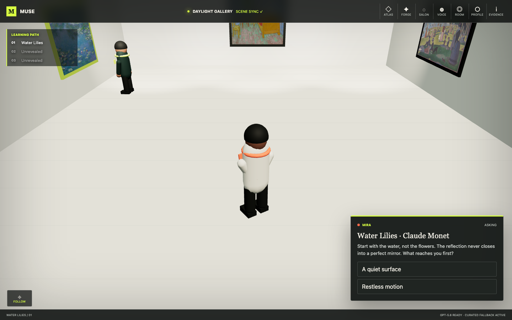

# MUSE: Embodied Learning World

MUSE turns a GPT-5.6 lesson plan into visible behavior inside a walkable museum. Mira does not simply narrate a map: she walks to a declared artwork anchor, turns toward the declared detail, points, asks for an observation, and changes the physical route in response.

Built with Codex for the **Education** track of [OpenAI Build Week](https://openai.com/zh-Hans-CN/build-week/).



## The judging path

1. Choose what you want to learn to notice.
2. Follow Mira to *Water Lilies*.
3. Answer from observation. `A quiet surface` routes next to *The Bedroom*; `Restless motion` routes next to *La Grande Jatte*.
4. At every stop, dialogue is gated on Mira being within 0.6 m of the declared anchor and within 20 degrees of the declared artwork-facing direction.
5. Complete three stops and receive a learning map that ties answers back to visible evidence.

This path works without credentials. With `OPENAI_API_KEY`, the same strict contract is produced live by GPT-5.6 and labeled accordingly.

## Run locally

Requirements: Node.js 20 or newer.

```bash
npm install
cp .env.example .env
npm start
```

Open <http://127.0.0.1:4175>. The `.env` file is optional for the curated demo path.

### Optional environment

```bash
OPENAI_API_KEY=...
OPENAI_MODEL=gpt-5.6
OPENAI_REALTIME_MODEL=gpt-realtime
WORLDLABS_API_KEY=...
INTEGRATION_ADMIN_TOKEN=...
PORT=4175
```

Secrets stay server-side. The OpenAI host is fixed to `api.openai.com`; the runtime has no configurable alternate LLM endpoint.

## Where GPT-5.6 is used

- **Lesson planning:** the Responses API returns a strict three-stop contract using only versioned artwork, detail, gesture and effect IDs.
- **Adaptive routing:** GPT supplies bounded semantic choices; deterministic code resolves the route and owns all movement, coordinates and rendering.
- **Perspective Salon:** GPT-5.6 returns three contrasting readings grounded only in the capped evidence digest from the current session.
- **Voice:** the optional browser voice path uses OpenAI Realtime WebRTC through the server's unified `/v1/realtime/calls` relay.
- **Failure behavior:** invalid, late or unavailable model output never becomes `live`; the validated curated contract keeps the complete experience available.

All Responses API calls use `store: false`, a privacy-preserving hashed `safety_identifier`, strict Structured Outputs, a bounded timeout and one retry only for transient failures.

## Layered addition

The embodied inquiry is the stable core. Optional capabilities are isolated tools, so one unavailable service cannot break the lesson:

| Layer | What is implemented | No-key behavior |
| --- | --- | --- |
| Atlas | Three procedural worlds plus an archived World Labs splat | Procedural worlds remain available |
| Forge | Protected World Labs generate/poll adapter | Clearly locked; no request is sent |
| Salon | Three in-world characters and evidence-grounded GPT-5.6 perspectives | Curated perspectives use the same contract |
| Voice | OpenAI Realtime WebRTC session | Text remains active |
| Room | Four-person, TTL-limited HTTP event room | Solo session remains active |
| Profile | Local learning goals and recap history | Fully available |
| Mobile | Touch joystick, follow assist and responsive drawers | Full lesson parity |
| Evidence | Model state, manifest, anchor distance and facing error | Fully available |

## Architecture

```text
Browser                              Server
src/main.js                          server.mjs
  LessonSession                       services/openai.js
  MuseumEngine                        services/worldLabs.js
    GuideDirector                     services/rooms.js
    ProceduralAvatar                  shared/contracts.js
    WorldLayer
  AppView / Profile / Voice / API
```

The important boundary is `shared/contracts.js`: GPT can choose only known IDs and verbs. `GuideDirector` converts those IDs into deterministic movement and exposes correspondence metrics to both tests and the Evidence drawer.

## Verify

```bash
npm run check
npm test
npm run audit:providers
npm run test:e2e
```

The Playwright suite covers desktop and mobile canvas pixels, the complete no-key route, alternate branching, scene synchronization, world switching, Salon characters, locked Forge behavior, room creation, local profile persistence and touch movement.

## Build Week authorship and delta

This is a clean repository and a new modular implementation authored in the current Codex session. The earlier `muse-infinity` project was used only as a research source for provider behavior, coordinate conventions and asset provenance. Its application/server source was not copied into this runtime.

New in this project:

- articulated player and guide rigs with gait, turning and gesture states;
- deterministic scene-to-character correspondence assertions;
- observation-driven physical branching;
- a fixed OpenAI-only model boundary;
- strict GPT-5.6 lesson and Salon contracts;
- full no-key path plus isolated Atlas, Forge, Voice, Room and Profile layers;
- desktop/mobile Playwright and canvas-pixel verification.

See [PROVENANCE.md](docs/PROVENANCE.md) for the precise reused asset ledger and [SUBMISSION.md](docs/SUBMISSION.md) for the demo script and Devpost checklist.

## Codex session

Majority core-functionality session for `/feedback`:

`019f7e53-4039-7cc1-9162-01906bec47b7`

## Current limits

- Collaboration rooms are in-memory and intended for a hackathon demo, not production persistence.
- Characters use authored procedural articulation rather than full-body IK, navmesh or lip sync.
- The archived splat uses the locally installed Spark renderer; the procedural world remains visible if WebGL support or asset decoding fails.
- Live provider checks require credentials and are intentionally excluded from the default test suite.
